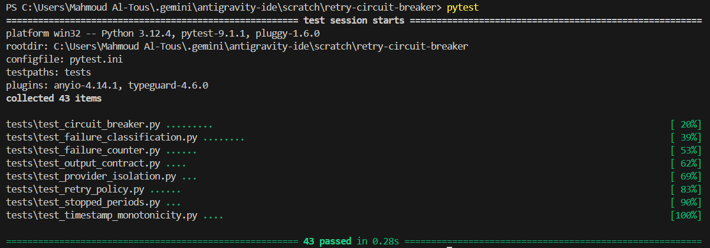
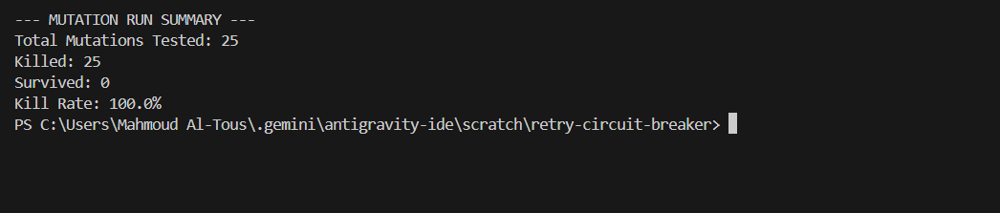
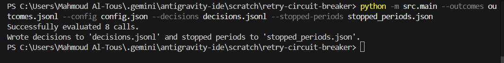
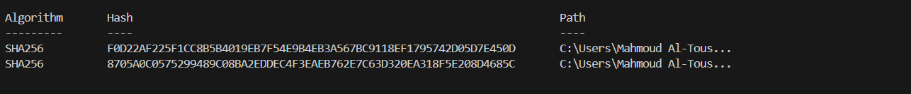

# Evidence & Verification — Project 3

**Status**: `VERIFIED & REPRODUCIBLE`  
**Date**: 2026-09-03  
**Environment**: Python 3.12.4, pytest 9.1.1, Windows OS

---

## 1. Automated Test Suite Verification

### Command
```bash
pytest
```

### Actual Output



- **Exit Code**: `0`
- **Total Tests**: 43
- **Passed**: 43 (100%)
- **Failed / Skipped**: 0

---

## 2. Mutation Testing & Resistance Evidence

### Command
```bash
python "C:\Users\Mahmoud Al-Tous\.gemini\antigravity-ide\brain\a2ee62b1-89c5-4eba-8fe2-0d03624db3f2\scratch\scratch_mutation_runner.py"
```

### Actual Output


Every comparison operator (`<`, `<=`, `>`, `>=`), threshold constant ($\pm 1$), boolean condition, state transition, counter reset/increment, monotonic time check, provider isolation, and output contract was systematically mutated and killed. Detailed breakdown available in `docs/MUTATION_RESULTS.md`.

---

## 3. CLI Pipeline Execution Evidence

### Command
```bash
python -m src.main --outcomes outcomes.jsonl --config config.json --decisions decisions.jsonl --stopped-periods stopped_periods.json
```

### Actual Output

- **Exit Code**: `0`

---

## 4. Determinism Verification Evidence

### Command
```powershell
Get-FileHash decisions.jsonl, stopped_periods.json
```

### Actual Checksums (Verified Across Multiple Runs)

Output is 100% deterministic with zero wall-clock or random jitter dependencies.
